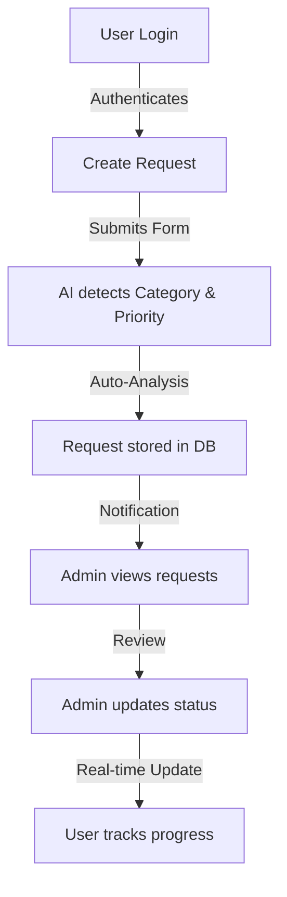

# 🚀 Swift Service Hub


### Smart Service Request Portal with AI-powered Automation

---

## 🧠 Overview

**Swift Service Hub** is a lightweight, intelligent service request management system designed for universities and enterprise environments.

It enables users to raise service requests (IT, Admin, Facilities) and allows support teams to efficiently track, manage, and resolve them. The system enhances traditional helpdesk workflows using **AI-driven automation** (simulated) to improve speed, accuracy, and user experience.

---

## 🎯 Problem Statement

In many organizations, service requests are:
*   Scattered across emails or manual systems
*   Difficult to track
*   Lacking proper prioritization

This leads to:
*   Delayed resolutions
*   Poor visibility
*   Inefficient workflows

---

## 💡 Solution

Swift Service Hub provides:
*   A centralized platform for raising and managing requests
*   Automated categorization and prioritization using AI logic
*   Real-time status tracking

---

## ✨ Features

### ✅ Core Features
*   📝 Create Service Requests
*   📋 View Requests with Filters (Category, Status, Priority)
*   🔄 Update Status (Open → In Progress → Resolved)
*   🔐 Role-Based Authentication (User/Admin)

### 🤖 AI-Powered Features
*   **Auto Category Detection**: Automatically assigns category (IT/Admin/Facilities) based on user input.
*   **Smart Priority Detection**: Detects urgency and assigns priority (High/Medium).
*   **Smart Suggestions**: Provides instant suggestions to resolve common issues.

---

## 🏗️ Architecture

### 🔹 Type
Modular Monolith (Frontend + Backend + DB)

### 🔹 Flow
Frontend (React/Vite) → API (Node/Express) → Database (SQLite)

### 🔹 Components
*   **Frontend**: React, TypeScript, Tailwind CSS, shadcn/ui
*   **Backend**: Node.js + Express
*   **Database**: SQLite (File-based persistence)
*   **AI Logic**: Rule-based keyword detection (Client-side)

---

## � Workflow



---

## �🔌 API Endpoints

### 🔐 Authentication
*   `POST /api/auth/login` - Authenticate user

### 📝 Requests
*   `POST /api/requests` → Create request
*   `GET /api/requests` → Get all requests
*   `PATCH /api/requests/:id` → Update status

---

## 🗄️ Data Model

```json
{
  "id": "REQ-SEED001",
  "title": "WiFi Issue",
  "description": "WiFi not working",
  "category": "IT",
  "priority": "High",
  "status": "Open",
  "name": "User Name",
  "email": "user@example.com",
  "suggestion": "Try restarting...",
  "createdAt": "2023-10-27T10:00:00.000Z"
}
```

---

## 🔐 Credentials

Use these pre-configured accounts to access the portal:

### 👨‍💼 Admin
*   **Username**: `admin`
*   **Password**: `admin123`

### 👤 User
*   **Username**: `john`
*   **Password**: `john123`

---

## 🚀 Getting Started

### 1. Clone the Repository
```bash
git clone <YOUR_GIT_URL>
cd swift-service-hub
```

### 2. Install Dependencies
```bash
# Frontend
npm install

# Backend
cd server
npm install
```

### 3. Initialize Database
```bash
cd server
npm run seed
```

### 4. Run the Application
You need two terminals:

**Terminal 1 (Backend):**
```bash
cd server
npm start
```
> Runs on http://localhost:3000

**Terminal 2 (Frontend):**
```bash
npm run dev
```
> Runs on http://localhost:8080

---

## 📊 Optional Enhancements
*   Dashboard with analytics
*   Real-time updates
*   Email notifications
*   Database integration (PostgreSQL)

---

## ⚡ Innovation & Differentiation
Unlike traditional service request systems, this project introduces:
*   AI-based automation for categorization and prioritization
*   Smart suggestions to reduce support workload
*   Clean and minimal user experience

---

## 👨‍💻 Author
**Surya Kiran**
Aspiring AI Product Manager | Fullstack Developer
